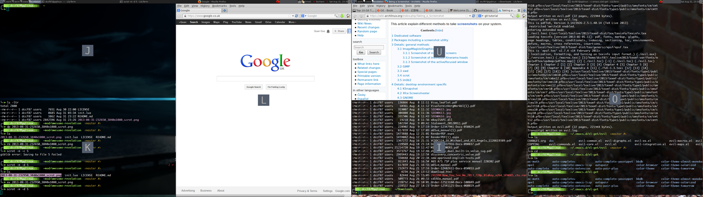

# revelation.lua

Provides Mac OSX like 'Expose' view of all clients. 

This is a fork from [revelation](https://github.com/bioe007/awesome-revelation)
It is modified from the original revelation.lua for incorporating with awesome 3.5 or later. 
It also have some features.  

**Now master branch works for both master and stable awesome WM**

## Changes since 2015-09-26
When all clients are exposing, you can zoom (__Modkey + Shift + hintbox charater__ or __right button__ of the mouse)
or kill a client (__middle button__ of the mouse) and the position of hintboxes will be updated accordingly.

## Changes since 2014-02-19
* Now the revlation is able to handle the special clients(float, fullscreen or maximized etc.)
* When you select an minimized client, the revelation will un-minimized it and then focuse on it.
* Added an option to change character ordering

## Changes after 2013-12-30
* Now it is possible, in revelation.init({...}), to change the default settings of 
  revelation module.

* Function `revelation(...)` now accept the parameter as a table `{rule={...}, is_excluded=...,
curr_tag_only=...}`. 

1. To add specify rules `revelation({rule={...},...})`.
2. To exclude the clients matched by the rules instead of including `revelation({rule={...}, 
is_excluded=true})`.
3. `{...,curr_tag_only=true}` make the revelation only collect the client from current
  tags.

## Changes from the original revelation
* Support awesome 3.5 or later 

* Add the support of multiple screens. Now multiple 'Expose' views will be shown 
  on the multiple screens at the same time.

* The way of selecting and focusing the client was changed. The old way that is
  navigating clients by pressing the keys "j, h, k, l"  and then selecting the
  client by pressing key "Enter" was deprecated. Now each client in the 'Expose'
  views come with a letter surrounding by a hint box, you can select the client
  by pressing the corresponding letter in the hint box.  The idea and codes of this method
  was copied from the module [hint](https://github.com/zackpete/hints). 
  
* Add zoom mode. Add the function of zooming the client by pressing the right
  button of the mouse.

* The unwanted clients can be excluded by the parameter`{rule={...}....}`. 

## Screenshot

## Usage

### Installation
 (From user's awesome configuration directory, usually ~/.config/awesome)

 1. Clone the repository:

        git clone https://github.com/guotsuan/awesome-revelation revelation

 2. Include it at the top of your rc.lua file:
    `local revelation=require("revelation")`

 3. **Important: Add `revelation.init()` after `beautiful.init()`**

 3. Define a global keybinding (e. g. `ModKey + e`) for revelation in your rc.lua:

        globalkeys = awful.util.table.join(
        awful.key({ modkey,           }, "Left",   awful.tag.viewprev       ), 
        awful.key({ modkey,           }, "Right",  awful.tag.viewnext       ),
        awful.key({ modkey,           }, "Escape", awful.tag.history.restore),
        awful.key({ modkey,           }, "e",      revelation),
        awful.key({ modkey,           }, "j",
        function ()
            awful.client.focus.byidx( 1)
            if client.focus then client.focus:raise() end
        end),

    **NOTE:** Always double check the key binding syntax against the version of
    Awesome which you are using.

 4. Restart Awesome (usually __Modkey + Control + r__) and try the keybinding __Modkey + e__.

 It should bring up all clients from the current tags on all screens and set the layout to fair.
 You can focus clients with the __cursor__ keys, and then press the __left__ button to select,
 or you can directly focus a client by pressing the corresponding key shown in the hint box.
 Press the right mouse button to zoom the client or __Escape__ to abort.

### Configuration
 Revelation's configuration is done through the init() function
 
 There are three basic settings, shown with default values:

    -- The name of the tag created for the 'exposed' view
    revelation.tag_name = 'Revelation'

    -- A table of matcher functions (used in client filtering)
    revelation.exact = awful.rules.match
    revelation.any   = awful.rules.match_any

    -- Character order for selecting clients
    revelation.charorder = "jkluiopyhnmfdsatgvcewqzx1234567890",

 The rule matching functions must conform to `awful.rules.match` prototypes.

 For client matching rules, we follow the same syntax as awful.rules expects.
 If `rule.any == true`, then we call the `config.match.any` function.

to change the settings, use:

     revelation.init({tag_name = ..., match = {...}, charorder = ...})

### Examples
 All clients:

     awful.key({modkey}, "e", revelation)

 To match all urxvt terminals:

     awful.key({modkey}, "e", function()
                revelation({rule={class="URxvt"}})
             end)
 To match clients with class 'foo' or 'bar':

     awful.key({modkey}, "e", function()
                revelation({
                            rule{class={"foo", "bar"},
                            any=true}
                            })
            end)

 To exclude the clients,  we set:

     awful.key({modkey}, "e", function()
             revelation({rule={class="conky"}, is_excluded=true})
             end)

 To set only collect clients from current tag

     awful.key({modkey}, "e", function()
                 revelation({rule={class="conky"}, is_excluded=true, 
                curr_tag_only=true})
                 end)

## Credits

### Maintenance
    * Quan Guo <guotsuan@gmail.com>
    * Perry Hargrave <resixian@gmail.com>

### Contributions, many thanks!
    * Daniel Hahler <github@thequod.de>
    * Yauhen Kirylau
    * Nikola Petrov <nikolavp@gmail.com>

### Original authors
    * Espen Wiborg <espenhw@grumblesmurf.org>
    * Julien Danjou <julien@danjou.info>

    (c) 20013-2014 Quan Guo
    (c) 2009-12 Perry Hargrave
    (c) 2008 Espen Wiborg, Julien Danjou
