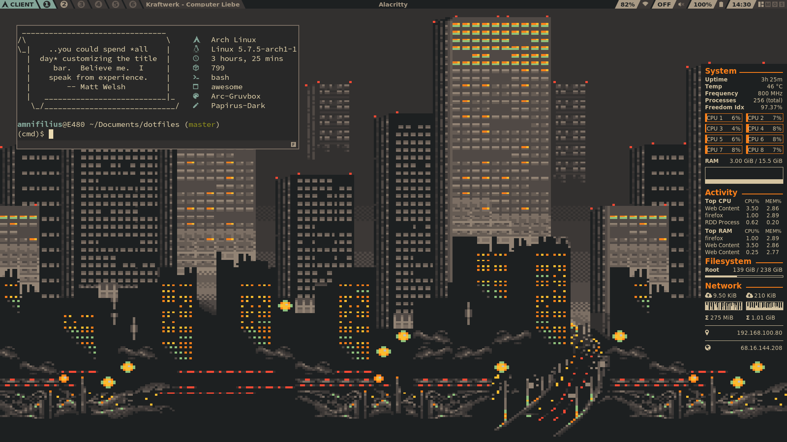

# Dotfiles

> Ohne Fleiß kein Rice.
> - DrCracket

A repository for more sophisticated configurations of applications I use on a
daily basis. My philosophy is to find a good balance between functionality and
eye-candy, while keeping an eye on resource consumption. I put a lot of care
into a consistent and appealing look and try to use the
[gruvbox](https://github.com/morhetz/gruvbox) colorscheme for everything.



## Installation

First clone the repository with all submodules.

```sh
git clone --recurse-submodules https://github.com/DrCracket/dotfiles
```

Files in the root folder should be symlinked into `$HOME` (prepend a `.` to the
symlink names) and directories in the config folder should be symlinked into
`$HOME/.config/`. I assume that the following applications are already
installed. I just explain how to get my particular configurations running. Also
make sure that the fonts [DejaVu Sans](https://dejavu-fonts.github.io/) and
[Sauce Code Pro Nerd
Font](https://github.com/ryanoasis/nerd-fonts/tree/master/patched-fonts/SourceCodePro)
are installed.

### Neovim ([config/nvim](config/nvim/))
To set up my neovim configuration the
[vim-plug](https://github.com/junegunn/vim-plug) plugin manager is required. To
install it simply run the following command.

```sh
curl -fLo ~/.local/share/nvim/site/autoload/plug.vim --create-dirs \
    https://raw.githubusercontent.com/junegunn/vim-plug/master/plug.vim
```

After setting it up launch neovim and run the command `:PlugInstall` to install
all other plugins. Now restart neovim and everything should be working.

### Bash ([inputrc](inputrc), [bashrc](bashrc), [bash\_profile](bash_profile))
If available, the bash configuration sources
[bash-completions](https://github.com/scop/bash-completion) and
[complete-alias](https://github.com/cykerway/complete-alias) to get command
line completions. The former is available as an official package in Archlinux
and the latter can be found in the AUR. To integrate git into the prompt
[git-prompt](https://github.com/git/git/blob/master/contrib/completion/git-prompt.sh)
is used, it should already be installed along with git.
The configuration also makes use of neofetch.

### Neofetch ([config/neofetch](config/neofetch))
Neofetch is configured to be used as a terminal greeter. It displays [fortune
cookies](https://www.shlomifish.org/open-source/projects/fortune-mod/), so make
sure the package is installed (available with pacman).
[Boxes](https://boxes.thomasjensen.com/) is also required for the terminal
greeter (an AUR package exists).

### Awesome ([config/awesome](config/awesome), [xinitrc](xinitrc), [Xresources](Xresources))
Awesome uses [mpv](https://mpv.io/) internally to play remote mpd streams.
Other integrated applications are only used in some keybindings and are thus
more or less optional or easily replaced. Take a look at calls to
[awful.spawn](https://awesomewm.org/doc/api/libraries/awful.spawn.html) in the
[rc.lua](config/awesome/rc.lua) config file, it should be rather obvious. To
get GTK applications to match the colorscheme as close as possible install
[arc-gruvbox-theme](https://github.com/cyrinux/arc-gruvbox-theme) (can be found
in the AUR) and
[Papirus-Dark](https://github.com/PapirusDevelopmentTeam/papirus-icon-theme)
(official Archlinux package exists). To understand how to control my awesome
configuration take a look at
[modalawesome](https://github.com/DrCracket/modalawesome).

### Conky ([conkyrc](conkyrc))
Conky makes use of
[absolutely-proprietray](https://github.com/vmavromatis/absolutely-proprietary)
to display the current Stallman Freedom Index. This package can be found in the
AUR.

### Alacritty ([config/alacritty](config/alacritty)), Ranger ([config/ranger](config/ranger)), Tmux ([tmux.conf](tmux.conf))
Some of these applications don't have additional dependencies and if they have,
they are integrated as git submodules or git subtrees so no additional steps
are required.

### Misc ([misc](misc))
The misc folder contains some useful shell scripts and systemd service files,
which don't necessarily belong to any of the aforementioned programs.
